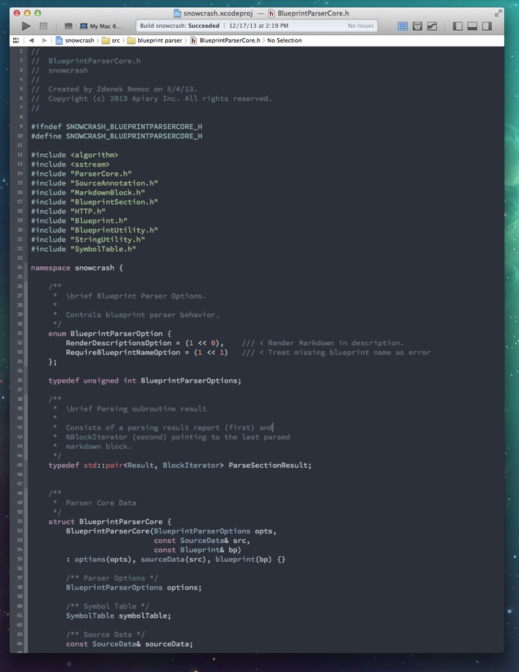
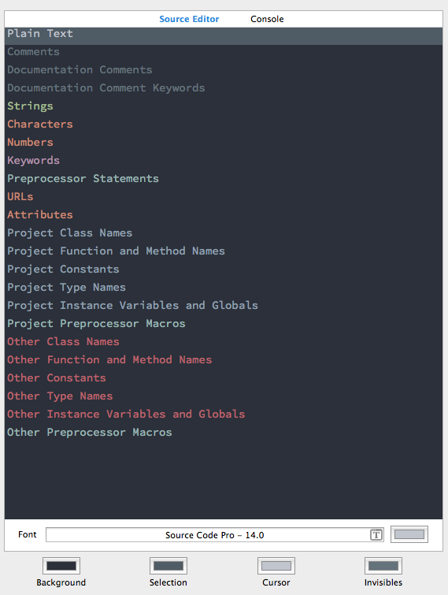

# Space Gray - Xcode

Xcode port of **@kkga**'s [Spacegray theme for Sublime Text](https://github.com/kkga/spacegray). 

## Screenshot

## Fonts & Colors settings

## Installation

### Source Code Pro Font

If you do not have the [Source Code Pro](http://blogs.adobe.com/typblography/2012/09/source-code-pro.html) font installed you can download it its binaries from [SourceForge](http://sourceforge.net/projects/sourcecodepro.adobe/files/).

### Space Gray Xcode Theme

1. [Download](https://raw2.github.com/zdne/spacegray-xcode/master/Space%20Gray.dvtcolortheme) the `Space Gray.dvtcolortheme` file.
2. In Finder, `Go > Go to Folder` and paste `~/Library/Developer/Xcode/UserData/FontAndColorThemes`, press enter.
3. Copy downloaded `Space Gray.dvtcolortheme` into the `FontAndColorThemes` directory.
4. Relaunch Xcode, `Xcode > Preferences...` in `Fonts & Colors` select `Space Gray`.
