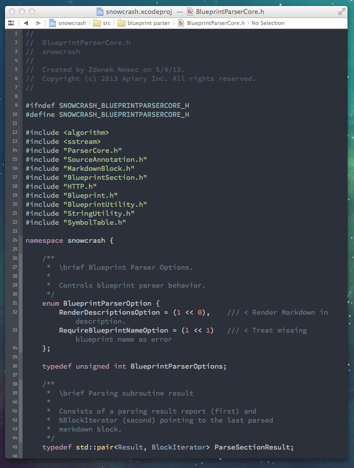
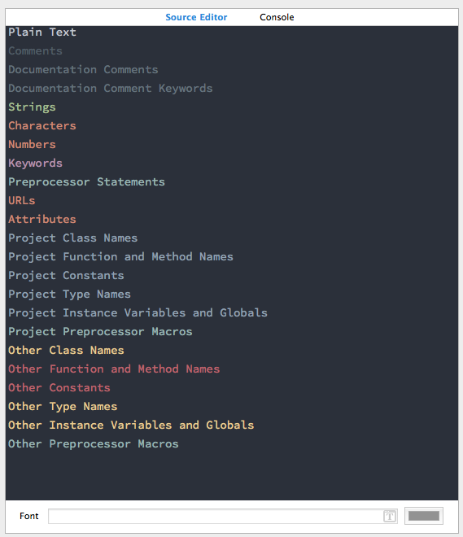
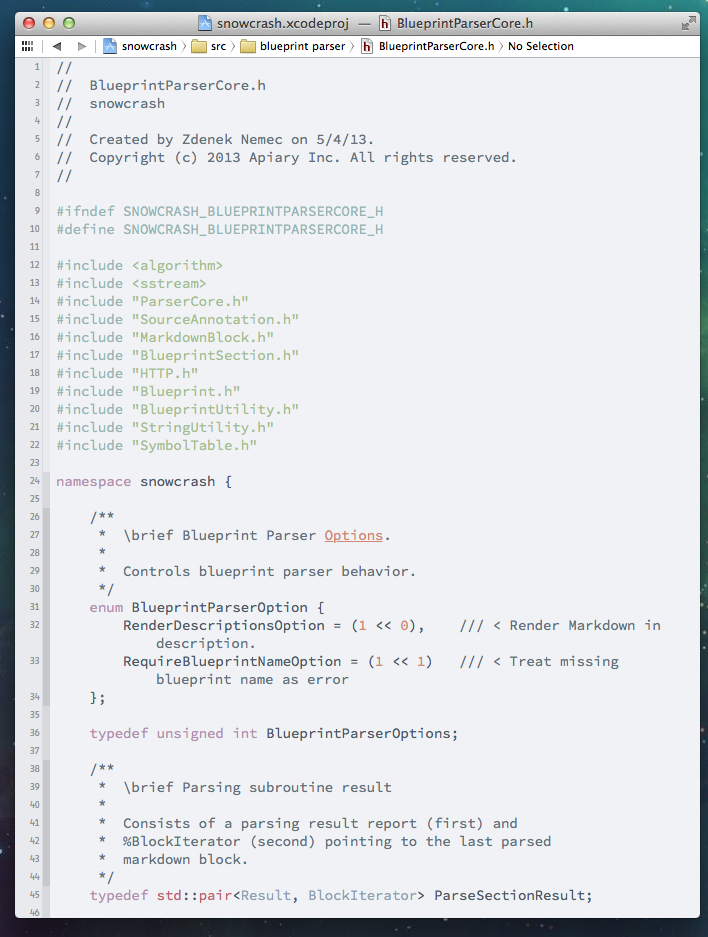
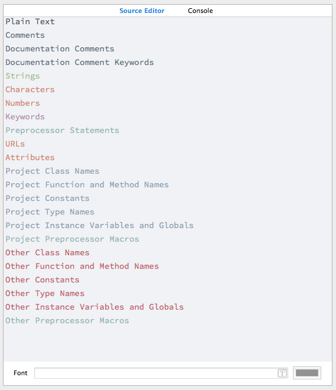

# Space Gray & Silver Xcode Themes

Xcode port of **@kkga**'s [Spacegray theme for Sublime Text](https://github.com/kkga/spacegray). 

## Space Gray

## Silver

## Installation

### Source Code Pro Font

If you do not have the [Source Code Pro](http://blogs.adobe.com/typblography/2012/09/source-code-pro.html) font installed you can get it at [SourceForge](http://sourceforge.net/projects/sourcecodepro.adobe/files/).

### Space Gray & Silver Xcode Theme

1. Download & unzip the [latest release](https://github.com/zdne/spacegray-xcode/releases/).
2. In Finder, `Go > Go to Folder` and paste `~/Library/Developer/Xcode/UserData/FontAndColorThemes`, press enter.
3. Copy `Space Gray.dvtcolortheme` and `Silver.dvtcolortheme` from the downloaded archive into the `FontAndColorThemes` directory.
4. Relaunch Xcode, `Xcode > Preferences...` in `Fonts & Colors` select `Space Gray` or `Silver`.

